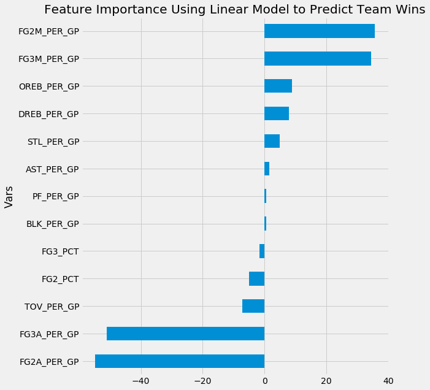
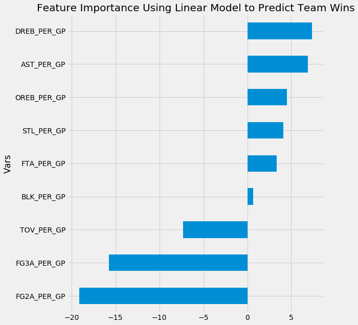
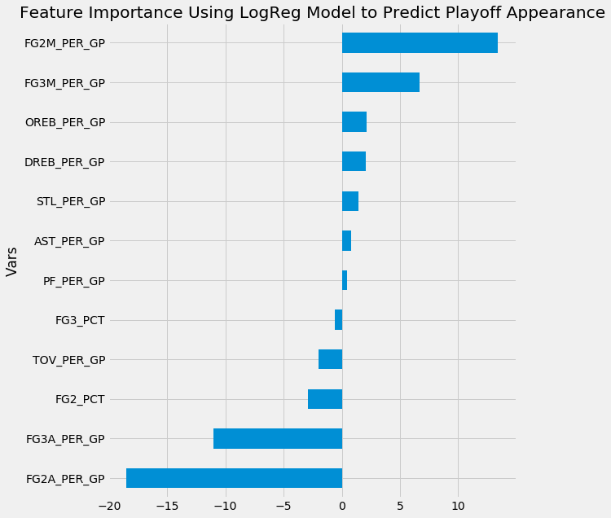
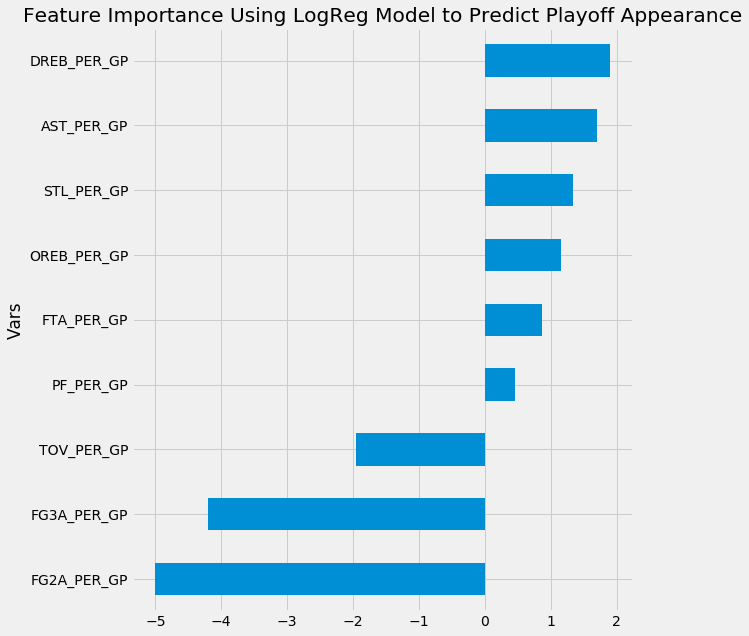
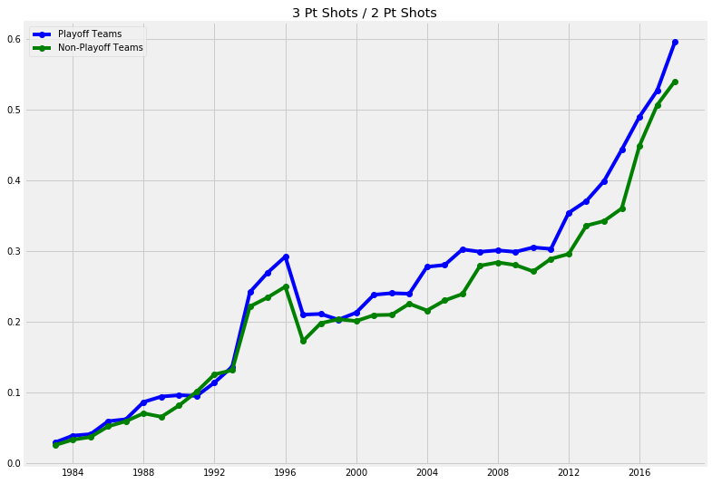
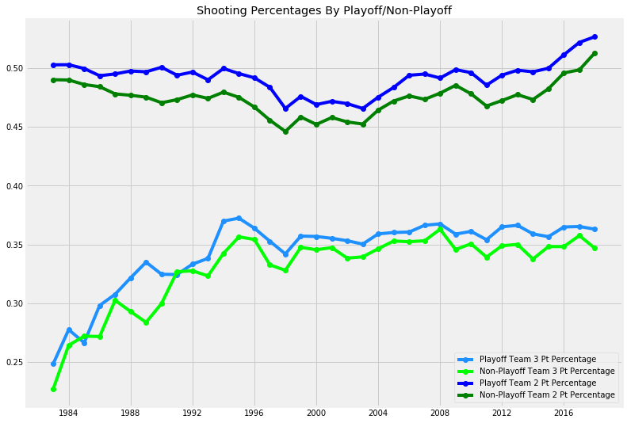
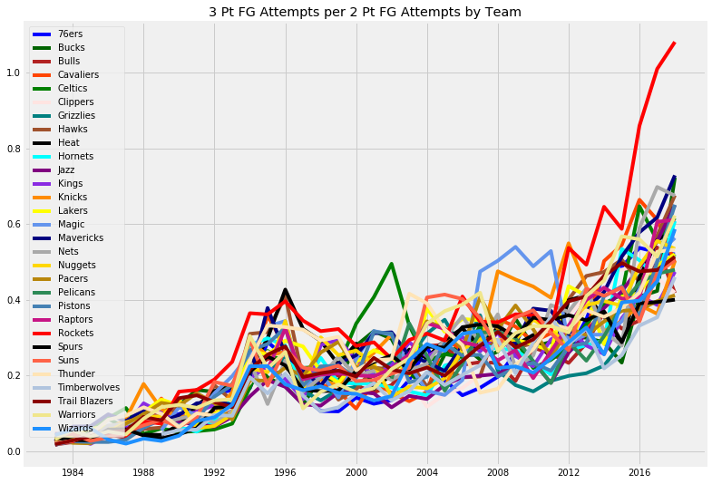
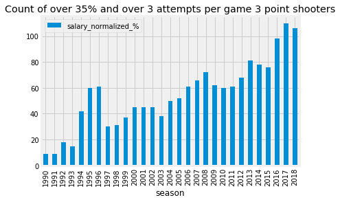
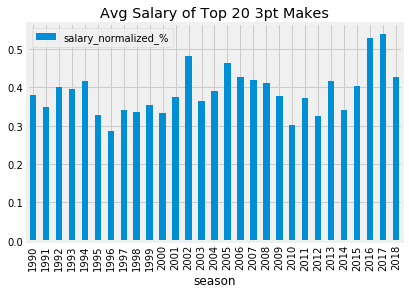
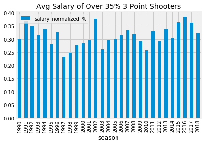

# Rise of the 3 Point Shot in the NBA

## Problem Statement

The popularity and usage of the 3 point shot has risen substantially in the NBA in the last 10+ years. This is due in large part to a higher usage and trust of analytics throughout the league. Some teams have taken larger strides than others into implementing more 3 point shots per game, but the league as a whole 3 point shots per game are trending upwards. The goal of my project is to try and see if this trend is actually accurate. Are 3 point shots more representative for success than 2 point shots? Are teams that attempt more 3 point shots than others more successful?

## Executive Summary

### Objectives
- Collect NBA data
    - 3 point field goals and 2 point field goals for both players and teams
        - Attempts, makes, and percentages
    - Team wins and playoff berths from 1983 onwards for measures of team success
        - 1983 was the first year 16 teams were selected to the playoffs
    - Player salary from 1990 onwards for measures of individual player value
        - 1990 was earliest data available
- Visualize trends of the data to show how the NBA has been changing over these timeframes
- Construct both regression and classification models in order to target which type of shot is more important to success
    - Regression model utilized to show how many wins in the 82 game season a given team will have
    - Classification model utilized to show whether or not a given team will make the playoffs, appear in the NBA Finals, or win the NBA Championship

### Data Gathering
Data was collected using three different methodologies, shown as links to their codebooks:
1. [Player Statistics](https://github.com/bgp09002/NBA/blob/master/1.%20Data%20Gathering/Get%20Player%20Stats.ipynb)
    - The library `basketball_reference_web_scraper` was used. This library scrapes data from the website [basketball-reference.com](https://www.basketball-reference.com/), which houses NBA statistics dating back to the 1940s.
2. [Player Salaries](https://github.com/bgp09002/NBA/blob/master/1.%20Data%20Gathering/Get%20Player%20Salaries.ipynb)
    - The library `selenium` was used to scrape player name and salary data by year from [hoopshype.com](https://hoopshype.com/salaries/players/).
3. [Team Statistics](https://github.com/bgp09002/NBA/blob/master/1.%20Data%20Gathering/Get%20All%20Teams%20Stats.ipynb)
    - The library `nba_api` was used. This library scrapes data from the [NBA's official website](https://stats.nba.com/).

### Feature Engineering
All of the data gathered from the three methodologies above was vast and full, but there was still some feature engineering necessary. 
- **2 point field goals** 
    - 3 point field goal makes and attempts are always specified, but 2 point field goal makes and attempts are not. There is a general field goal makes and attempt statline, so in order to create the specific 2 point field goal makes and attempts, I needed to subtract 3 point field goal makes and attempts from the general field goal totals.
- **Per game basis**
    - All of the scoring stats that I had accumulated were season totals. I needed to get everything on a per game played basis. Some players played in less games due to things like injuries or resting. As for team totals, two seasons in my dataset were shortened due to labor disputes causing lockouts. The 1998 season had 50 regular season games and the 2011 season had 66 regular season games.
- **3 pointer attempted per 2 pointer attempted**
    - Since the true goal of this project deals with the relation between and change over time of 3 pointers compared to 2 pointers, I needed to create a feature that distinctly shows this change.
- **Normalized Player Salary**
    - To account for inflation and a change in league salary cap over time, I had to normalize each players salary by making it a percentage of the league's total salary for that year. This makes each players normalized salary comparative year over year. 
    
### Modeling
While my goal is to determine whether 3 point shots or 2 point shots are more important in, modeling was used a source to target feature importance. Both linear regression and logistic regression modeling was used. Linear regression was used in order to predict regular season wins by team. Logistic regression was used to predict whether teams made the playoffs, made the NBA finals, or won the NBA championship.

**Linear Regression for Wins**:
1. First attempt was trying to see if only using offensive shooting statistics would work in order to keep everything in context. I modeled using: `FG2_PCT`, `FG3_PCT`, `FT_PCT`, `FG2A_PER_GP`, `FG3A_PER_GP`, `FG3A/FG2A`.
    - Train R2: 0.4028
    - Test R2: 0.2947
        - These values did not seem high enough and the model is overfit to the training data, so I didn't want to make any conclusions from it since I am able to add more features
2. Second attempt included: `FG2_PCT`, `FG3_PCT`, `FT_PCT`, `FG2M_PER_GP`, `FG2A_PER_GP`, `FG3M_PER_GP`, `FG3A_PER_GP`, `FTM_PER_GP`, `FTA_PER_GP`, `OREB_PER_GP`, `DREB_PER_GP`, `AST_PER_GP`, `PF_PER_GP`, `STL_PER_GP`, `TOV_PER_GP`, `BLK_PER_GP`.
    - Train R2: 0.8049
    - Test R2: 0.8293
        - These values are much higher and represent a strong model
        - The below picture shows the scaled coefficients of each feature from this model that also has a P Value below 0.05

3. Third attempt included: `FG2A_PER_GP`, `FG3A_PER_GP`, `FTA_PER_GP`, `OREB_PER_GP`, `DREB_PER_GP`, `AST_PER_GP` ,`PF_PER_GP`, `STL_PER_GP`, `TOV_PER_GP`, `BLK_PER_GP`
    - Train R2: 0.6248
    - Test R2: 0.6649
        - These values are lower than the prior attempt, but give an easier differentiation between 3 point shots and 2 point shots a team takes
        - The below picture shows the scaled coefficients of each feature from this model that also has a P Value below 0.05

**Logistic Regression for Playoffs Classification**:
1. First attempt was trying to classify whether or not teams made the playoffs. Features included: `FG2_PCT`, `FG3_PCT`, `FT_PCT`, `FG2M_PER_GP`, `FG2A_PER_GP`, `FG3M_PER_GP`, `FG3A_PER_GP`, `FTM_PER_GP`, `FTA_PER_GP`, `OREB_PER_GP`, `DREB_PER_GP`, `AST_PER_GP`, `PF_PER_GP`, `STL_PER_GP`, `TOV_PER_GP`, `BLK_PER_GP`.
    - Train Accuracy: 0.8459
    - Test Accuracy: 0.8307
        - Good accuracy, and since the playoffs class is relatively evenly split (16 out of 30 teams make the playoffs each season) accuracy is a good measure.
        - The below picture shows the scaled coefficients of each feature from this model that also has a P Value below 0.05

2. Second attempt was trying to classify whether or not teams made the NBA finals, meaning they won their respective division and had to play the other division winner to win the NBA championship. Same features as the first attempt were used. Train accuracy was 0.9315, which appears good, but was not a good measure of a successful model in this circumstance due to there being a significant disparity between teams who did not make the NBA finals and those who did.
    - Train Sensitivity: 0.0741
    - Test Sensitivity: 0.1111
        - Not a good model to use for any clarrification
3. Third attempt was trying to classify whether or not teams made the NBA finals, meaning they won their respective division and had to play the other division winner to win the NBA championship. Same features as the first attempt were used. Train accuracy was 0.9657, which appears good, but was not a good measure of a successful model in this circumstance due to there being a significant disparity between teams who did not make the NBA finals and those who did.
    - Train Sensitivity: 0.0741
    - Test Sensitivity: 0.1111
        - Not a good model to use for any clarrification
4. Fourth attempt included: `FG2A_PER_GP`, `FG3A_PER_GP`, `FTA_PER_GP`, `OREB_PER_GP`, `DREB_PER_GP`, `AST_PER_GP` ,`PF_PER_GP`, `STL_PER_GP`, `TOV_PER_GP`, `BLK_PER_GP`
    - Train Accuracy: 0.8142
    - Test Accuracy: 0.7717
        - This is lower accuracy than the first attempt, but still accurate while being easier to interpret, with there being only one 3 point shot variable and one 2 point shot variable
        - The below picture shows the scaled coefficients of each feature from this model that also has a P Value below 0.05
        

### Data Trends

Ratio of 3 point attempts to 2 point attempts is steadily trending upwards by year. NBA teams are finding value in more 3 point shots at the expense of 2 point shots. Note how playoff teams are almost always higher.

It makes sense that playoff teams have higher shooting percentages than non-playoff teams. An interesting note is how 2 point shooting percentage is increasing. Likely due to teams substituting 2 point shots further from the basket for 3 point shots.

The Houston Rockets are accelerating much faster than the rest of the league. They were the first time to have more 3 point shots in a season than 2 point shots.

|                   | All Teams | Top Ten FG3A/FG2A (All Seasons) | Top Ten FG3A/FG2A (Since 2010) |
|-------------------|-----------|---------------------------------|--------------------------------|
| Make Playoffs     | 57.35%    | 70.28%                          | 72.22%                         |
| Finals Appearance | 7.11%     | 11.67%                          | 16.67%                         |
| NBA Championship  | 3.55%     | 5.28%                           | 6.67%                          |

This shows how teams that are top ten in the league over that season in `FG3A/FG2A` find more success than the rest of the league. This is shown even more apparently since 2010 as the league changes to more 3 point shooting.

### Limitations
A large limitation to this project is the inability to get totals of specific locations on the court of shot selection. While the most important differentiator is whether or not a given shot was a 3 pointer or a 2 pointer, it would be helpful to see distributions of shots from specific spots on the court or specific distances away from the basket. One major outcome of the move towards analytics in the NBA has been the near elimination of mid-range shots (2 pointers that are farther away from the basket) to make way for higher percentage shots closer to the basket or 3 pointers which are slightly lower percentage shots but give the team 1 extra point.

## Conclusions and Further Points
Interpretting the feature importance for each successful model is the major factor in determining the answer to whether or not 3 point shots are more representative for success than 2 point shots. Viewing the strongest models that included the most features for both Linear Regression and Logistic Regression, both models 2 strongest positive influences are `FG2M_PER_GP` and `FG3M_PER_GP` while both models also share the 2 strongest negative influences of `FG2A_PER_GP` and `FG3A_PER_GP`, all in the same order. When looking at just the Logistic model, `FG2M_PER_GP` seems to have a significant advantage. While that could be interpretted to represent 2 point shots are more important, I believe it's cancelled out by how `FG2A_PER_GP` is also much more of a negative influence. This makes it hard to actually gain anything from viewing them.

The model that had the best combination of accuracy and interpretability was Logistic Regression attempt 4, though its results were also mirrored in its Linear Regression counterpart of the same features. These models show that `FG2A_PER_GP` have a stronger negative influence on each model than `FG3A_PER_GP`. This leads me to believe that 3 pointers are more important to success due to more attempts not contributing as negatively as more 2 pointer attempts. I can agree with the NBA's move towards implementing more of a focus on 3 point shooting. Conceptually, I would recommend teams further pushing their `FG3A/FG2A` since increasing the relation between each shot should help. This is directly in line with the graphs and table in the Data Trends section above. 

With this information being the case, it makes sense that people who are good at 3 point shooting would be appearing more frequently in the NBA, which is shown in the graph below.

But beyond them appearing more frequently, it would also make sense if NBA teams were valuing those players higher and giving them higher salaries. The graphs below show 2 different ways to slice NBA 3 point shooters, those over 35% shooting and those in the top 20 of 3 pointers made. Neither seems to show that large of a bump in their salaries. As time progresses, I would guess that these players will be valued higher.

To further test this project, I would like to analyze it with a few more years of data as the NBA continues the current trend it's on. It would be interesting to see if there is a breaking point when they start to level off their `FG3A/FG2A` to reach the optimal point. 